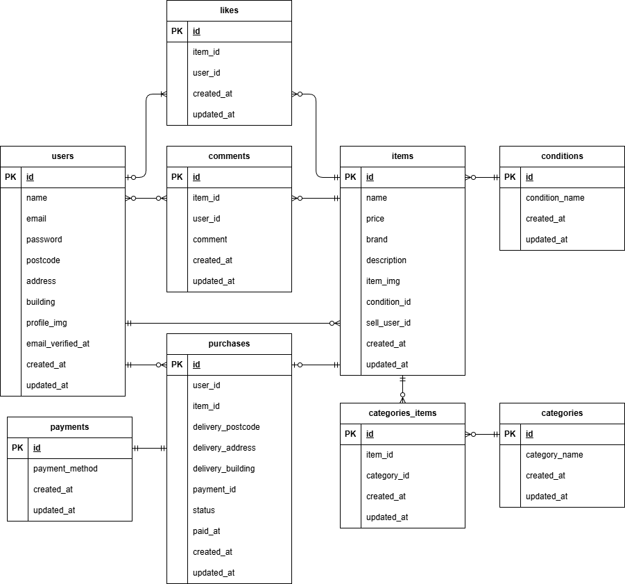

# flea-market-app

## Dockerビルド
```bash
git clone git@github.com:Nakama624/flea-market-app.git
cd flea-market-app
docker-compose up -d --build
```

## Laravel環境構築
```bash
docker-compose exec php bash
composer install
cp .env.example .env　　～環境変数の変更～
php artisan key:generate
php artisan migrate
php artisan db:seed

```

【mailhog手順】
≪env≫
MAIL_MAILER=smtp
MAIL_HOST=mailhog
MAIL_PORT=1025
MAIL_USERNAME=null
MAIL_PASSWORD=null
MAIL_ENCRYPTION=null
# MAIL_FROM_ADDRESS=null
MAIL_FROM_ADDRESS=no-reply@example.com
MAIL_FROM_NAME="${APP_NAME}"

≪docker-compose≫
   mailhog:
        image: mailhog/mailhog
        ports:
            - "1025:1025"
            - "8025:8025"


## 使用技術（実行環境）
PHP：Laravel Framework 8.83.29

## ER図


## URL
・ログイン
  http://localhost/login
・新規登録
  http://localhost/register
・マイページ
　http://localhost/mypage
・商品一覧
　http://localhost/
・phpMyAdmin
　http://localhost:8080/
